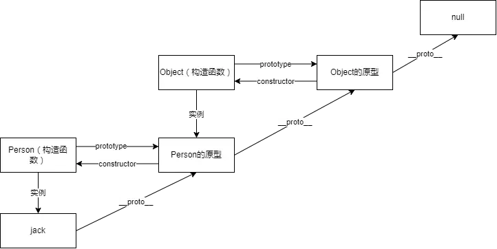
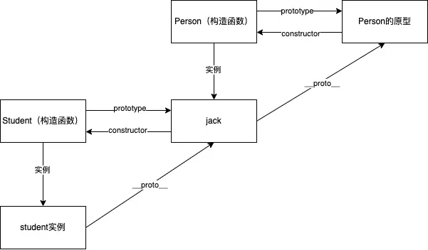
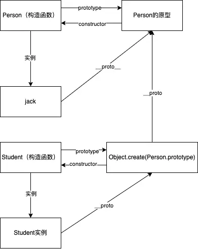

# JavaScript

## 1. 说说 Javascript 中的数据类型？如何区分?

Javascript 数据类型分为**基本类型**和**引用类型**。<br>
简单数据类型有 6 种: number, string, null, undefined, boolean, symbol<br>
引用类型只有一种 object, 包括数组、对象和函数。<br>

基本类型数据保存在在栈内存中。<br>
引用类型数据保存在堆内存中，引用存在栈中。引用可以理解为是数据的存储地址。<br>

需要注意的是,我们在声明的时候并不能确认数据类型，只有到运行期间才会确定当前类型。<br>
确认数据类型的话，可以使用 `typeOf`。但是 `typeof(null)` 会返回 object，并且 typeof 不能区分函数、数组和对象。<br>
比较推荐用 `Object.prototype.toString.call()`来判断, 能够精确的返回数据的类型,包括日期/正则表达式/函数类型。

代码如下:

```js
typeof(null) // object
Object.prototype.toString.call(null) // [object Null]
Object.prototype.toString.call([]) // [object Array]
Object.prototype.toString.call({}) // [object Object]
Object.prototype.toString.call(3) // [object Number]
Object.prototype.toString.call('test') // [object String]
Object.prototype.toString.call(/^abc/) // [object RegExp]
Object.prototype.toString.call(new Date()) // [object Date]
Object.prototype.toString.call(() => {})) // [object Function]
```

## 2. JavaScript 数组的常用方法有哪些？

- 增：

  `push`: 向数组末尾插入任意数量的参数。返回数组的最新长度。改变原有数组。

```js
let colors = ['red'];
const len = colors.push('green', 'blue');
console.log(len); // 3
console.log(colors); // ['red', 'green', 'blue']
```

`unshift`: 向数组开头插入任意数量的参数。返回数组的最新长度。改变原有数组。

```js
let colors = ['red'];
const len = colors.unshift('green', 'blue');
console.log(len); // 3
console.log(colors); // ['green', 'blue', 'red']
```

`splice`: 传入三个参数，分别是开始位置，删除的元素个数，插入的元素。返回删除元素组成的数组。改变原有数组。

```js
let colors = ['red', 'green', 'blue'];
let removeList = colors.splice(1, 0, 'yellow', 'black');
console.log(removeList); // []
console.log(colors); // ['red','yellow', 'black', 'green', 'blue']
```

`concat`: 创建一个当前数组的副本，并把参数添加到副本末尾。常用来合并多个数组。不改变原有数组。

```js
let colors = ['red'];
let newColors = colors.concat('green', 'blue', ['yellow']);
console.log(newColors); // ['red', 'green', 'blue', 'yellow']
console.log(colors); // ['red']
```

- 删：

  `pop`: 删除数组的最后一个元素。返回被删除的元素。改变原有数组。

  `shift`: 删除数组的第一个元素。返回被删除的元素。改变原有数组。

  `splice`: 改变原有数组。返回被删除元素组成的数组。

```js
let colors = ['red', 'green', 'blue'];
let removeList = colors.splice(1, 2);
console.log(removeList); // ['green', 'blue']
console.log(colors); // ['red']
```

`slice`: 分割数组，不影响原有数组。

```js
let colors = ['red', 'green', 'blue', 'yellow', 'orange', 'pink'];
let newColors = colors.slice(2, 4);
console.log(newColors); // ['blue', 'yellow']
console.log(colors); // ['red', 'green', 'blue', 'yellow', 'orange', 'pink']
```

- 改：

  `splice`：同上面。返回被删除元素的数组。改变原有数组

- 查：

  `indexOf`: 返回要查找的元素在数组中的位置，如果没找到则返回 -1

  `includes`: 数组是否包含某个元素。返回 true 或 false

  `find`: 查找满足某个条件的元素。返回第一个满足条件的元素。

  `findIndex`: 查找满足某个条件的元素索引。返回第一个满足条件的元素索引。

- 排序：

  `reverse`: 反转数组。改变原有数组。返回新数组。

```js
let a = [1, 2, 3, 4, 5];
let newArr = a.reverse();
console.log(newArr); // [5, 4, 3, 2, 1]
console.log(a); // [5, 4, 3, 2, 1]
```

`sort`: 数组排序。改变原有数组。返回新数组。

```js
let a = [1, 2, 3, 4, 5];
let newArr = a.sort((x, y) => y - x);
console.log(newArr); // [5, 4, 3, 2, 1]
console.log(a); // [5, 4, 3, 2, 1]
```

- 迭代(都不改变原有数组)：

  `forEach`: 对数组的每一项都运行传入的函数。没有返回值。

  `map`: 对数组的每一项都运行传入的函数。返回每次结果组成的新数组。

  `filter`: 对数组的每一项都运行传入的函数。返回过滤后的数组。

  `some`: 对数组的每一项都执行操作，如果有一个返回 true. 则结果就为 true

  `every`: 对数组的每一项都执行操作，只有所有项都返回 true. 结果才为 true

- 转换(不改变原有数组)：

`join`: 接收一个参数作为分隔符，分割数组所有元素。返回分割后的字符串。不传参默认分隔符为 `,`

```js
let a = [1, 2, 3];
a.join(); // 1,2,3
a.join('|'); // 1|2|3
```

## 3. Javascript 字符串的常用方法有哪些？

- 增：
  `concat`: 用于将一个或多个字符串拼接成一个新字符串。不改变原字符串。

```js
let str = 'hello';
let newStr = str.concat(' ', 'world', '!');
console.log(newStr); // 'hello, world!'
console.log(str); // 'hello'
```

- 删(都不改变原有数组)：

  `slice`: 切割字符串。返回切割后的字符串。不改变原有字符串。

  `substring`: 切割字符串。返回切割后的字符串。不改变原有字符串。

  `substr`: 跟`substring`的区别是第二个参数是长度，而不是结束节点的索引。

- 改(都不改变原有数组)：

  `trim()、trimLeft()、trimRight()`: 去除空格。并返回新的字符串。

  `repeat()`: 接收一个整数参数，表示要将字符串复制多少次，然后返回拼接后的结果

  `padStart()、padEnd()`: 复制字符串，如果小于指定长度，则在相应一边填充字符，直至满足长度条件.

  `toLowerCase()、 toUpperCase()`: 大小写转换。

- 查：

  `charAt`: 返回给定索引位置的字符.

```js
'hello'.charAt(1); // 'e'
```

`at`: 返回给定索引位置的字符，支持负数。

```js
'hello'.at(-1); // 'o'
```

`indexOf`: 从字符串开头去搜索传入的字符串，并返回位置（如果没找到，则返回 -1 ）
`startWith`: 字符串是否以参数开头，返回 true 或 false.
`includes`: 字符串是否包含 参数，返回 true 或 false.

- 转换：
  `split`: 通过分隔符分割字符串，返回分割后元素的数组。

```js
let str = 'test*test*test';
let strArr = str.split('*');
console.log(strArr);
```

## 4. 谈谈 JavaScript 中的类型转换机制

JavaScript 中的类型转换可以分为**显式类型转换**和**隐式类型转换**。

显式类型转换：使用 `Number()`, `String()`, `Boolean()`, `parseInt()`, `parseFloat()`这种显示转换函数

隐式类型转换：不需要显示调用函数。比如 `!!'test'`, `+'22'`。

JavaScript 中的类型转换规则如下：

1. 字符串转换为数字：可以使用 Number() 函数将字符串转换为数字类型，如果字符串不能转换为数字，则返回 NaN。

2. 数字转换为字符串：可以使用 String() 函数将数字转换为字符串类型。

3. 布尔值转换为数字：true 转换为 1，false 转换为 0。

4. 数字转换为布尔值：0、NaN 和空字符串转换为 false，其他数字转换为 true。

5. null, undefined 转数字

```js
Number(null); // 0
Number(undefined); // NaN
```

6. **对象转换为原始值：对象转换为原始值时，会调用对象的 `valueOf()` 和 `toString()` 方法，如果这两个方法都不存在或者返回的值不能转换为原始值，则会抛出 TypeError 异常。**

```js
let a = {};
// Number(a); // NaN
// String(a); // TypeError

Object.prototype.valueOf = function () {
  return 1;
};
Object.prototype.toString = function () {
  return 'hello';
};

console.log(Number(a)); // 1
console.log(String(a)); // hello
```

7. 原始值转换为对象：可以使用对应的包装对象将原始值转换为对象类型，比如 使用 `new Number(10)` 将数字 10 转换为 Number 对象。

## 5. == 、 === 和 `Object.is()`三者的区别，分别在什么情况使用？

== 在比较中会先进行类型转换，再确定操作数是否相等。分以下几种情况：

- 两个都为简单类型，字符串和布尔值都会转换成数值，再比较

```js
2 == true; // false
'2' == true; // false
'1' == true; // true
```

- 简单类型与引用类型比较，对象转化成其原始类型的值通过 `valueOf` 或者 `toString` 函数，再比较

```js
let a = { name: 'Jack', age: 18 };
Object.prototype.valueOf = () => 1;
a == 1; // true
```

- 两个都为引用类型，则比较它们是否指向同一个对象

需要注意的是, null 和 undefined 相等。<br>
NaN 跟谁都不相等。<br>

=== 只有两个操作数在不转换的前提下相等才返回 true。即类型相同，值也需相同。

`Object.is()`与 `===` 只有两处不同:

- +0 不等于-0
- NaN 等于自身

代码如下：

```js
+0 === -0; // true
NaN === NaN; // false

Object.is(+0, -0); // false
Object.is(NaN, NaN); // true
```

## 6. 深拷贝浅拷贝的区别？如何实现一个深拷贝？

JavaScript 数据类型有两种：基本类型和引用类型。

基本类型数据保存在在栈内存中。<br>
引用类型数据保存在堆内存中，引用数据类型的变量存在栈中，指向堆内存中实际对象的地址。

当拷贝类型为引用类型的情况下：<br>
浅拷贝是拷贝一层，属性为对象时，拷贝对象和原对象指向同一个地址。一个对象的修改会影响另一个对象。<br>
深拷贝则是新开内存，拷贝对象和原对象指向不同的地址。因此也不会互相影响。

常用的方法，`Object.assign()`和扩展运算符`...`都属于浅拷贝。<br>
如果要实现深拷贝，有这样几个方法：

- JSON.parse(JSON.stringify()), 需要注意的是，如果深拷贝的对象是函数和 undefined 会报错
- lodash.cloneDeep()
- 自己手写一个深拷贝方法。
  具体方法就是利用递归，只要某个属性是对象类型，就递归；若是其他类型，则直接复制。代码如下：

```js
function deepCopy(data) {
  if (typeof data !== 'object' || data === null) {
    // typeof null 的结果是 object
    return data;
  }
  let result = Array.isArray(data) ? [] : {};
  for (let key in data) {
    // for...in 会遍历obj原型上的属性，因此需要用hasOwnProperty(key)来判断下当前属性是否属于obj
    if (data.hasOwnProperty(key)) {
      if (typeof data[key] === 'object') {
        result[key] = deepCopy(data[key]);
      } else {
        result[key] = data[key];
      }
    }
  }
  return result;
}
```

## 7. 说说你对闭包的理解

闭包是 js 中一种特殊的结构。形成闭包只需要：

- 函数嵌套
- 内部函数访问外部函数的局部变量

日常使用中，会把嵌套的函数返回来便于使用。
被内部函数访问的这个变量会长存于内存中。就好像是返回的这个内部函数附带一个变量，这个变量有着独立的作用域。

如果我们需要回收这个变量。可以通过切断闭包的引用来达到这一目的。

```js
function fun() {
  let a = 1;
  return function () {
    console.log(a++);
  };
}
let aFun = fun();

aFun(); // 1
aFun(); // 2

aFun = null; // 切断闭包的引用来回收闭包中的变量
```

ES5 中 js 的作用域有全局作用域和函数作用域。
全局作用域的变量会长存与内存。函数作用域的变量，函数执行创建，执行完毕销毁。
闭包可以算是第三种作用域。闭包变量会长存与内存且不会污染全局变量。

这么说，就会发现闭包类似于 ES6 中的模块作用域。ES6 新增了模块作用域，模块作用域的变量也能长存与内存。
webpack 打包的时候，模块作用域是会被 babel 翻译成闭包的。

其实，仔细想想 React 中的 state，也是长存与内存。可以通过闭包或者模块作用域来实现。

闭包因为长存与内存，比较常见的应用是 函数缓存、模块化与函数柯里化。

## 8. 说说你对作用域链的理解

我们一般将作用域分成：全局作用域、函数作用域、块级作用域(ES6 新增)。

JavaScript 遵循的是静态作用域，变量被创建时作用域就确定了，而非执行阶段确定的。<br>
比如下面这段代码：

```js
var a = 2;
function foo() {
  console.log(a);
}
function bar() {
  var a = 3;
  foo();
}
bar(); // 输出2
```

当在 Javascript 中使用一个变量的时候，首先 Javascript 引擎会尝试在当前作用域下去寻找该变量，如果没找到，再到它的上层作用域寻找，以此类推直到找到该变量或是已经到了全局作用域.<br>
如果在全局作用域仍然找不到该变量，它就会在全局范围内隐式声明该变量(非严格模式下)或是直接报错

## 9. JavaScript 原型，原型链 ? 有什么特点？

首先需要知道的是，在 JavaScript 里，一切皆对象。

每个构造函数都有一个 prototype 属性，是一个对象，我们称之为原型对象。原型对象有个 constructor 属性，指向这个函数。<br>
prototype 上的属性和方法可以被实例对象调用。<br>

每个对象都有`__proto__`属性，指向其构造函数的原型对象。当我们使用对象的属性时候，如果本身不包含某个属性，就会到其构造函数的原型上查找，而构造函数的原型也是对象，也可以向上查找，直到 null 为止。

看图就明白了：



## 10. Javascript 如何实现继承？

- 构造函数继承：只能继承构造函数里的属性和方法<br>
  其实就是在子构造函数里面调用父构造函数（需要修改 this 指向），这样就把父构造函数里的属性和方法放到了子构造函数里了。

```js
function Person(name, age) {
  this.name = name;
  this.age = age;
  this.say = function () {
    console.log('你好');
  };
}
Person.prototype.sing = function () {
  console.log('唱歌');
};

function Student(name, age, score) {
  Person.call(this, name, age); // 由于Person里的this指向为Person的实例，这里修改this指向为Student的实例
  this.score = score;
}

const jack = new Student('Jack', 18, 100);
console.log(jack.name); // Jack
jack.say(); // 你好
jack.sing(); // 无结果，Student没有继承Person原型上的方法
```

- 原型链继承<br>
  通过上面的例子我们可以看出，构造函数继承并不能继承原型链上的方法。那我们怎么才能继承父构造函数原型上的方法呢？<br>
  我们可以把子构造函数原型指向父构造函数的原型。

```js
Student.prototype = Person.prototype; // - 原始版 缺陷：Student的原型改变导致Person原型改变，因此不可取
```

原型一样，自然能够继承原型上的方法。
但是这样一来就会出现问题，原型是个对象，是引用类型数据，我们再 **修改`Student.prototype`会导致`Person.prototype`的变化。这是不合理的。** 比如：

```js
Student.prototype.dance = function () {
  console.log('跳舞');
};

const jack = new Person('Jack', 18);
jack.dance(); // 跳舞    Person的原型上是没有dance方法的。这里是因为我们扩展了Student的原型导致Person原型变化
```

常用的解决办法是，我们将子构造函数的原型指向福构造函数的一个实例。

```js
Student.prototype = new Person();
```



前面说过，调用一个函数的属性时，编译器会先看对象本身是否有这个属性，如果没有就到对象的`__proto__`属性上去找，如果还找不到，继续找`__proto__`的`__proto__`属性，直到 null 为止。这样一来，Student 实例就能够调用 Person 实例的方法，从而调用 Person 原型的方法。

- 组合继承<br>
  把构造函数继承和组合继承结合起来就是组合继承了。整体代码如下：

```js
function Person(name, age) {
  this.name = name;
  this.age = age;
  this.say = function () {
    console.log('你好');
  };
}
Person.prototype.sing = function () {
  console.log('唱歌');
};

function Student(name, age, score) {
  Person.call(this, name, age);
  this.score = score;
}
Student.prototype = new Person();
Student.prototype.constructor = Student; // 修改constructor指向
```

组合继承调用了两次父构造函数，且每创建一个子构造函数，都会生成一个父构造函数实例。还是不够完美。

- 寄生组合继承

```js
function Person(name, age) {
  this.name = name;
  this.age = age;
  this.say = function () {
    console.log('你好');
  };
}
Person.prototype.sing = function () {
  console.log('唱歌');
};

function Student(name, age, score) {
  Person.call(this, name, age);
  this.score = score;
}
Student.prototype = Object.create(Person.prototype); // Object.create(proto)创建一个对象，这个对象的__proto__属性为proto
Student.prototype.constructor = Student; // 修改constructor指向
```



Student 实例能够调用 Student 原型上的方法，而 Student 原型又可以通过`__proto__`获取 Person 原型上的方法。这样就实现了 Student 继承 Person 原型上的方法。

- 使用类

最好用的继承，自然是使用 ES6 里的 class:

```js
class Person {
    constructor(name, age) {
        this.name = name
        this.age = age
    }
    say() {
        console.log(this.name)
    }
}
class Student extends Person {
    ...
}
```

ES6 的 class 本质上还是函数。如果用 babel 转译后会发现，它会被转译成寄生组合继承。

## 11. 谈谈 this 对象的理解

1. **普通函数:** 分两种情况：

- 如果函数被当做方法来调用，那它的 this 就是调用它的对象。

- 如果函数(不是箭头函数)被当做函数来调用，那么 this 值要么是全局对象(非严格模式)，要么是 undefined(严格模式)。

```js
function foo() {
  console.log(this);
}

foo(); // window or global
```

```js
function fun() {
  function test() {
    console.log('object :>> this', this);
  }
  test();
}
fun(); // window or global

let obj = {
  fun: function () {
    function test() {
      console.log('object :>> this', this);
    }
    test();
  }
};
obj.fun(); // window or global
```

```js
const obj = {
  foo() {
    console.log(this);
  }
};

obj.foo(); // obj
```

```js
function Person(name) {
  this.name = name;
}

const person = new Person('Alice');
console.log(person.name); // Alice
```

当使用 call、apply 或 bind 方法来调用函数时，this 可以被显式地指定。例如：

```js
function foo() {
  console.log(this);
}

const obj = { name: 'Alice' };

foo.call(obj); // obj
foo.apply(obj); // obj

const boundFoo = foo.bind(obj);
boundFoo(); // obj
```

2. **箭头函数:** 箭头函数不会创建自己的 this，它会继承上层执行上下文的 this。不能通过 call、apply、bind 等方法来改变它的指向，因为箭头函数的 this 指向是在函数定义时就确定了的，是静态的。

```js
const obj = {
  foo() {
    const arrow = () => {
      console.log(this);
    };
    arrow.call(window);
  }
};

obj.foo(); // obj
```

## 12. JavaScript 中执行上下文和执行栈是什么？

执行上下文是 JavaScript 引擎在执行代码时所创建的一个抽象概念。每当 JavaScript 引擎开始执行一个函数或全局代码时，都会创建一个新的执行上下文。执行上下文可以理解为一个对象，它包含了当前代码执行时所需的所有信息。每个执行上下文都有三个重要的属性：

1. 变量对象（Variable Object）：用于存储函数内部的变量和函数声明。对于全局执行上下文来说，变量对象就是全局对象。

2. 作用域链（Scope Chain）：用于解析变量和函数的作用域。作用域链是一个指向父级执行上下文的指针列表，它决定了当前执行上下文可以访问哪些变量和函数。

3. this 值：用于指向当前执行上下文所属的对象。

执行栈是 JavaScript 引擎在执行代码时所使用的一种数据结构，它是一个后进先出（LIFO）的栈，用于存储所有执行上下文。每当 JavaScript 引擎执行一个函数时，都会创建一个新的执行上下文，并将其推入执行栈的顶部。当函数执行完毕后，它的执行上下文会从执行栈中弹出，控制权会回到上一个执行上下文。

执行栈的作用是维护代码执行的顺序和执行上下文的创建和销毁。它保证了当前正在执行的代码具有正确的执行上下文和作用域，使得 JavaScript 引擎能够正确地执行代码。

## 13. 说说 JavaScript 中的事件模型(事件传播机制)

js 事件传播有三个阶段：事件捕获、目标阶段、事件冒泡

- 事件捕获：事件从 document 一直向下传播到目标元素。默认情况，该阶段不会执行事件监听函数。
- 目标阶段：事件到达目标元素, 触发目标元素的监听函数。如果事件是通过 addEventListener 注册的，则按照注册顺序执行，如果是通过 on\* 属性注册的，则只执行最后一个注册的处理函数。addEventListener 第三个参数可以指定事件是否再捕获阶段触发。

```js
addEventListener(type, listener, useCapture); // useCapture 设为 true, 则会在捕获阶段触发该事件
```

- 事件冒泡：事件从目标元素冒泡到 document。

一般情况下，默认都是冒泡阶段触发事件，因此事件触发的顺序是从内到外。

取消默认事件：`e.preventDefault()`，比如一个表单的 submit 按钮，直接点击会触发提交。我们可以通过`e.preventDefault()`来阻止它提交。

取消冒泡: `e.stopPropagation()`

## 14. 解释下什么是事件代理？应用场景？

利用事件冒泡的原理，把事件加到父级上，触发执行效果

好处：减少事件数量，提高性能。新添加的元素，依然可以触发该事件

比如一个页面有 100 个按钮，点击每个按钮都会触发某个操作。我们可以给这 100 个按钮的父级添加点击事件，然后再判断是哪个按钮，执行对应的操作。

React 就使用了事件代理。React 中的 onClick 等事件都不是原生事件，而是 React 自己实现的合成事件。也就是通过事件代理将子节点的事件添加到 root 节点上。

## 15. typeof 与 instanceof 区别

typeof 和 instanceof 都是 JavaScript 中用于判断数据类型的运算符，但它们的作用和使用方式有所不同。

typeof 运算符用于判断一个变量的数据类型，它返回一个字符串，表示该变量的数据类型。typeof 运算符可以用于任何类型的变量，包括基本数据类型和引用数据类型，例如：

```js
typeof 123; // "number"
typeof 'hello'; // "string"
typeof true; // "boolean"
typeof undefined; // "undefined"
typeof null; // "object"
typeof [1, 2, 3]; // "object"
typeof { name: 'Tom', age: 18 }; // "object"
typeof function () {}; // "function"
```

需要注意的是，typeof 运算符对于 null 类型的变量会返回 "object"，这是一个历史遗留问题。

而 instanceof 运算符用于判断一个对象是否为某个类的实例，它返回一个布尔值，表示该对象是否为指定类的实例。instanceof 运算符只能用于引用数据类型，例如：

```js
var arr = [1, 2, 3];
arr instanceof Array; // true

var person = { name: 'Tom', age: 18 };
person instanceof Object; // true

function Animal(name) {
  this.name = name;
}
var cat = new Animal('Kitty');
cat instanceof Animal; // true
```

需要注意的是，instanceof 运算符判断的是对象的原型链，而不是对象本身的类型。如果一个对象的原型链中出现了指定类的原型对象，那么该对象就被认为是指定类的实例。

总之，typeof 运算符和 instanceof 运算符都用于判断数据类型，但它们的作用和使用方式有所不同。typeof 运算符用于判断变量的数据类型，而 instanceof 运算符用于判断对象是否为某个类的实例。

## 16. 说说 new 操作符具体干了什么？

new 操作符用于创建一个实例对象。new 主要做了一下内容：

1. 创建一个新对象。
2. 将该新对象的 `__proto__` 属性指向构造函数的 prototype 属性。
3. 将构造函数的 this 指向该新对象。
4. 执行构造函数中的代码，返回该新对象。

下面是一个手写 new 的例子：

```js
function Person(name, age) {
  this.name = name;
  this.age = age;
}

const jack = new Person('jack', 18);
console.log('object :>> jack', jack);

function newFunc(func, ...args) {
  let obj = {};
  obj.__proto__ = func.prototype;
  func.call(obj, ...args);
  return obj;
}

const jim = newFunc(Person, 'jim', 18);
console.log('object :>> jim', jim);
```

## 17. ajax 原理是什么？如何实现？

Ajax 可以在不刷新整个页面的情况下，向服务器发送请求并获取数据，然后使用 JavaScript 动态更新页面内容，从而提高用户体验和页面性能。

Ajax 的实现原理主要包括以下几个步骤：

创建 XMLHttpRequest 对象：使用 JavaScript 中的 XMLHttpRequest 对象来创建一个异步的 HTTP 请求对象。

发送 HTTP 请求：使用 XMLHttpRequest 对象的 open() 方法和 send() 方法来发送 HTTP 请求，可以设置请求的 URL、请求方式、请求头、请求参数等信息。

接收服务器响应：使用 XMLHttpRequest 对象的 onreadystatechange 事件来监听服务器的响应，当服务器返回响应时，可以通过 XMLHttpRequest 对象的 responseText 或者 responseXML 属性来获取响应数据。

处理响应数据：根据服务器返回的响应数据，使用 JavaScript 动态更新页面内容，例如更新文本、图片、表格、列表等元素。

目前比较常用的 ajax 库是 axios，基于 Promise 封装。

下面是一个使用原生 JavaScript 实现 Ajax 的例子：

```js
function ajax(url, method, data, success, error) {
  var xhr = new XMLHttpRequest();
  xhr.onreadystatechange = function () {
    if (xhr.readyState === 4) {
      if (xhr.status === 200) {
        success(xhr.responseText);
      } else {
        error(xhr.status);
      }
    }
  };
  xhr.open(method, url, true);
  xhr.setRequestHeader('Content-Type', 'application/json');
  xhr.send(JSON.stringify(data));
}

ajax(
  '/api/login',
  'POST',
  { username: 'Tom', password: '123456' },
  function (response) {
    console.log('登录成功：' + response);
  },
  function (status) {
    console.log('登录失败：' + status);
  }
);
```

在这个例子中，我们定义了一个 ajax() 函数，该函数接收一个 URL、请求方式、请求参数、成功回调函数和失败回调函数等参数。在函数中，我们使用 XMLHttpRequest 对象来发送 HTTP 请求，并根据服务器的响应来调用成功回调函数或失败回调函数。

总之，Ajax 技术可以在客户端和服务器之间进行异步数据交互，从而提高用户体验和页面性能。使用 Ajax 技术，需要创建一个 XMLHttpRequest 对象，发送 HTTP 请求并接收服务器响应，最后使用 JavaScript 动态更新页面内容。

## 18. bind、call、apply 区别？如何实现一个 bind?

bind、call 和 apply 都是 JavaScript 中用于改变函数执行上下文的方法。它们的主要区别在于传递参数的方式不同。具体来说：

call 和 apply 都是立即调用函数，而且可以指定函数执行时的 this 值和参数列表。它们的区别在于传递参数的方式不同：call 方法接收一个参数列表，apply 方法接收一个参数数组。

bind 方法不会立即调用函数，而是返回一个新函数，新函数的 this 值被绑定到指定的对象，参数列表与原函数相同。新函数可以在稍后调用，调用时会执行原函数，并使用绑定的 this 值和参数列表。

下面是一个实现 bind 方法的示例：

```js
Function.prototype.myBind = function (context) {
  var self = this;
  var args = Array.prototype.slice.call(arguments, 1);
  return function () {
    var bindArgs = Array.prototype.slice.call(arguments);
    self.apply(context, args.concat(bindArgs));
  };
};
```

这个实现的核心是返回一个新函数，新函数内部调用原函数，并使用 apply 方法将 this 值绑定到指定的对象，并将参数列表合并。注意，这个实现还使用了 slice 方法来将 arguments 对象转换为数组，以便更方便地操作参数列表。

使用这个实现，可以将一个函数绑定到指定的对象上，例如：

```js
var obj = { name: 'John' };

function sayHello(greeting) {
  console.log(greeting + ', ' + this.name + '!');
}

var hello = sayHello.myBind(obj, 'Hello');
hello(); // 输出 "Hello, John!"
```

在这个示例中，sayHello 函数被绑定到 obj 对象上，并使用 myBind 方法返回了一个新函数 hello。调用 hello 函数时，会输出 "Hello, John!"。

## 19. 说说你对事件循环的理解

JavaScript 中的事件循环（Event Loop）是一种机制，用于调度和执行异步任务。事件循环会不断地从任务队列中取出任务并执行，直到任务队列为空为止。在事件循环中，任务被分为两类：宏任务和微任务。

宏任务（Macrotask）是指较大的任务，如 I/O 操作、定时器等。当一个宏任务执行完毕后，会将其中产生的微任务全部执行完毕后再取出一个宏任务执行。主要包括有`setTimeout`, `setInterval`, `requestAnimationFrame`

微任务（Microtask）是指较小的任务，如 Promise 回调函数、MutationObserver 回调函数等。当一个微任务被添加到任务队列中时，它会在当前宏任务执行完毕后立即执行。主要包括`promise.then`, `mutationObserver`

事件循环的执行过程如下：

执行当前宏任务（如 script 脚本）。

检查微任务队列是否为空，如果不为空，依次执行微任务，直到微任务队列为空为止。

从宏任务队列中取出一个任务并执行，直到宏任务队列为空或者达到了某个限制（如执行时间超时）为止。

如果宏任务队列为空，返回第二步，否则返回第三步。

需要注意的是，在同一次事件循环中，微任务的执行优先级高于宏任务。也就是说，当一个宏任务执行完毕后，会先执行其中产生的所有微任务，再去执行下一个宏任务。

## 20. 举例说明你对尾递归的理解，有哪些应用场景

尾递归是指在递归算法中，递归调用是函数体中的最后一个操作，也就是说，在递归调用后再无其他操作。这种情况下，编译器或解释器可以对递归进行优化，使得递归的空间复杂度降为 O(1)。

举个例子，比如计算斐波那契数列的第 n 个数，可以使用递归算法实现：

```js
function fibonacci(n) {
  if (n <= 1) {
    return n;
  }
  return fibonacci(n - 1) + fibonacci(n - 2);
}
```

但是，这种实现方式会导致空间复杂度为 O(n)，因为每次递归调用都会在内存中创建一个新的函数调用栈。如果使用尾递归实现，空间复杂度就可以降为 O(1)：

```js
function fibonacci(n, prev = 0, next = 1) {
  if (n === 0) {
    return prev;
  }
  return fibonacci(n - 1, next, prev + next);
}
```

在这个实现中，每次递归调用都是函数体中的最后一个操作，因此编译器可以对其进行优化，使得递归的空间复杂度为 O(1)。

尾递归除了可以优化递归算法的空间复杂度，还可以用于实现函数式编程中的一些高阶函数，比如 map、reduce 和 filter 等。这些函数都可以使用尾递归实现，从而避免了中间过程中的大量内存占用。

## 21. 说说 JavaScript 中内存泄漏的几种情况？

JavaScript 内存泄漏指的是在 JavaScript 程序中，分配的内存空间没有及时释放，导致内存占用不断增加，最终导致程序运行缓慢甚至崩溃的问题。简而言之，就是程序不再使用某个内存块时，没有及时释放它，导致该内存块一直被占用。

JavaScript 内存泄漏可能会发生在以下场景：

1. **全局变量的滥用**：在全局作用域中声明的变量，一旦不再使用却没有被删除或被垃圾回收，就会一直占用内存。

2. **闭包**：如果一个闭包引用了外部函数的变量，而这个闭包被保存下来，那么这些变量就无法被垃圾回收，导致内存泄漏。

3. **定时器和事件监听器的滥用**：如果一个定时器或事件监听器注册后没有被正确清除或解绑，就会一直占用内存。

4. **DOM 元素的滥用**：如果创建了大量的 DOM 元素却没有及时删除或被垃圾回收，就会导致内存占用不断增加。

解决 JavaScript 内存泄漏的方法包括：

1. 使用 let 或 const 关键字声明变量，避免使用全局变量。

2. 在不再需要的变量或对象上调用 delete 或 null，让它们脱离引用链，被垃圾回收。

3. 在定时器或事件监听器注册后，一定要正确清除或解绑。

4. 在创建大量的 DOM 元素时，使用对象池等技术来重复利用对象，避免频繁创建和销毁对象。

除此之外，还可以使用浏览器开发者工具的内存分析功能来定位和解决内存泄漏问题。

## 22. Javascript 本地存储的方式有哪些？区别及应用场景？

在 JavaScript 中，常见的本地存储方式有以下三种：

1. Cookie

Cookie 是一种存储在客户端的小型文本文件，可以在客户端和服务器之间传输。通过 JavaScript 可以设置和读取 Cookie，使用简单方便。Cookie 的缺点是存储容量小，只有 4KB 左右，而且每次请求都会将 Cookie 附加在请求头中，对网络性能有一定的影响。在应用场景方面，Cookie 可以用于存储用户的登录信息、购物车信息等。

2. Local Storage

Local Storage 是 HTML5 中新增的一种本地存储方式，可以存储大量数据，最大容量一般为 5MB 左右。Local Storage 是基于键值对存储数据的，支持字符串类型、数字类型和布尔类型等简单类型。Local Storage 使用简单，可以在客户端通过 JavaScript API 进行读写操作，适用于存储应用程序中的用户设置、用户数据等。

3. Session Storage

Session Storage 也是 HTML5 中新增的一种本地存储方式，与 Local Storage 类似，但是它存储的数据只在会话期间有效，会话结束后数据会自动清除。Session Storage 的存储容量也比 Local Storage 小，一般为 5MB 左右。Session Storage 与 Local Storage 的应用场景类似，但是更适用于存储一些敏感数据，如用户身份信息等。

除了上述三种方式，还可以使用 IndexedDB、Web SQL 等技术进行本地存储。这些技术支持更复杂的数据类型和数据结构，但是使用相对复杂，需要掌握更多的 API。在应用场景方面，它们适用于存储大量复杂的数据结构，如离线应用程序、在线文件管理等。

## 23. Javascript 中如何实现函数缓存？函数缓存有哪些应用场景？

函数缓存是指将函数的计算结果缓存起来，以避免重复计算。可以使用闭包来实现函数缓存。

使用闭包实现函数缓存的代码示例：

```js
function cacheFunction(fn) {
  const cache = {};
  return function (...args) {
    const key = JSON.stringify(args);
    if (!cache[key]) {
      cache[key] = fn.call(this, ...args);
    }
    return cache[key];
  };
}
```

返回一个对象更优雅一些：

```js
function cacheFunction(fn) {
  const cache = {};
  return {
    get(...args) {
      const key = JSON.stringify(args);
      if (!cache[key]) {
        cache[key] = fn.call(this, ...args);
      }
      return cache[key];
    },
    // 清除缓存
    clear() {
      Object.keys(cache).map((key) => delete cache[key]);
    }
  };
}
```

函数缓存的应用场景包括：

1. 计算密集型任务：如果函数需要进行大量计算，可以使用函数缓存来避免重复计算，提高性能。
2. 数据请求：如果函数需要从服务器获取数据，可以使用函数缓存来避免重复请求，减少网络请求次数。
3. 频繁调用的函数：如果函数需要被频繁调用，可以使用函数缓存来避免重复计算，提高性能。

## 24. 说说 Javascript 数字精度丢失的问题，如何解决？

JavaScript 中的数字精度丢失问题是因为 JavaScript 内部使用双精度浮点数表示数字。由于双精度浮点数的存储方式，它无法精确表示某些十进制数，从而导致精度丢失。

例如，0.1 + 0.2 的结果在 JavaScript 中为 0.30000000000000004，这是因为 0.1 和 0.2 都无法用双精度浮点数精确表示，它们的实际值比它们的二进制表示要稍微大一些。

解决 JavaScript 数字精度丢失问题的方法有以下几种：

1. 使用整数进行计算：将小数转换为整数进行计算，最后再将结果除以 10 的 n 次方，其中 n 为小数位数。例如，0.1 + 0.2 可以转换为 1 + 2 = 3，最后再除以 10 的 1 次方，得到 0.3。

2. 使用第三方库：例如 decimal.js 和 big.js 等库，它们提供了高精度计算的功能，可以避免 JavaScript 数字精度丢失的问题。

3. 使用 toFixed 方法：toFixed 方法可以将数字转换为指定小数位数的字符串，从而避免精度丢失。例如，(0.1 + 0.2).toFixed(1) 的结果为 "0.3"。

需要注意的是，使用整数进行计算虽然可以避免数字精度丢失的问题，但是也会导致整数溢出的问题，因此需要注意计算结果是否超出了 JavaScript 的安全整数范围。

## 25. 什么是防抖和节流？有什么区别？如何实现？

防抖和节流是两种常见的性能优化方法，用于控制函数被频繁触发时的执行次数和频率。

防抖和节流的区别在于：

- 防抖：在事件被触发 n 秒后再执行回调函数，如果在这 n 秒内又被触发，则重新计时。也就是说，当事件被触发后，函数并不会立即执行，而是等待一定时间后再执行。如果在这个时间内再次触发了该事件，则重新计时。

- 节流：在一定时间内只触发一次回调函数。也就是说，当事件被触发后，函数会立即执行，然后在一定时间内禁止再次触发该函数。等过了这个时间后，才能重新触发执行。
  防抖和节流的实现方法如下：

防抖的实现：

```js
function debounce(fn, wait) {
  let timer = null;
  return function (...args) {
    clearTimeout(timer);
    timer = setTimeout(() => {
      fn.call(this, ...args);
    }, wait);
  };
}
```

节流的实现：

```js
function throttle(fn, wait) {
  let lastTime = Date.now();
  return function (...args) {
    let nowTime = Date.now();
    if (nowTime - lastTime > wait) {
      fn.call(this, ...args);
      lastTime = nowTime;
    }
  };
}
```

其中，fn 是需要进行防抖或节流的函数，wait 是等待时间。

防抖和节流的应用场景如下：

- 防抖：输入框搜索、窗口大小改变等需要等待一定时间才能执行的操作。

- 节流：滚动加载、窗口大小改变等需要控制执行频率的操作。

## 26. 说说你对正则表达式的理解？应用场景？

正则表达式（Regular Expression）是一种用于匹配字符串模式的表达式，它可以用来检查、替换和提取字符串中符合条件的部分。

正则表达式的基本语法由一些特殊字符和普通字符组成，这些字符用于表示匹配规则，例如：

普通字符：表示匹配该字符本身，例如 "hello" 匹配字符串中的 "hello"。
元字符（Metacharacter）：表示匹配一类字符，例如 "\d" 匹配任意数字，"\w" 匹配任意字母数字字符。
字符类（Character Class）：表示匹配一组字符中的任意一个字符，例如 "[abc]" 匹配 a、b、c 中的任意一个字符。
量词（Quantifier）：表示匹配前面的字符出现的次数，例如 "a{3}" 匹配三个连续的 "a"。
边界（Boundary）：表示匹配字符串的边界，例如 "^" 匹配字符串的开头，"$" 匹配字符串的结尾。
正则表达式的应用场景非常广泛，例如：

表单验证：可以使用正则表达式来验证用户输入的邮箱、手机号、密码等格式是否正确。
数据提取：可以使用正则表达式来从 HTML、XML、JSON 等格式的文本中提取需要的数据。
文本替换：可以使用正则表达式来替换文本中的某些字符或字符串。
编辑器高亮：可以使用正则表达式来实现代码编辑器的语法高亮功能。
需要注意的是，正则表达式的语法较为复杂，需要一定的学习和练习才能熟练掌握。同时，正则表达式的性能较低，对于大规模的文本处理，需要使用其他更高效的算法和工具。

总之，正则表达式是一种用于匹配字符串模式的表达式，它可以用于检查、替换和提取字符串中符合条件的部分。正则表达式的应用场景非常广泛，包括表单验证、数据提取、文本替换、编辑器高亮等。

## 27. DOM 常见的操作有哪些？

DOM（文档对象模型）是指 HTML 和 XML 文档的编程接口，它定义了访问和操作 HTML 和 XML 文档的标准方法。常见的 DOM 操作包括：

1. 获取元素：通过 ID、class、标签名等方式获取元素，如 getElementById、getElementsByClassName、getElementsByTagName 等。
2. 修改元素：修改元素的内容、样式、属性等，如 innerHTML、innerText、style、setAttribute 等。
3. 添加元素：添加新元素到文档中，如 createElement、appendChild、insertBefore 等。
4. 删除元素：从文档中删除元素，如 removeChild、remove 等。
5. 事件处理：对元素添加事件监听器，如 addEventListener、removeEventListener 等。
6. 遍历节点树：遍历文档中的节点树结构，如 parentNode、childNodes、nextSibling 等。
   这些操作是 DOM 编程中最基本和常用的操作，通过它们可以实现对文档的访问和修改，从而实现动态交互效果。

## 28. 说说你对 BOM 的理解，常见的 BOM 对象你了解哪些？

BOM（Browser Object Model）是浏览器对象模型的简称，它提供了一组 JavaScript 对象，用于操作浏览器窗口和浏览器本身。BOM 对象的主要作用是与用户界面交互，包括控制浏览器窗口、对话框、处理用户输入等。

常见的 BOM 对象包括：

window 对象：表示浏览器的窗口，是 BOM 的核心对象。window 对象包括浏览器窗口的大小、位置、URL、历史记录、导航、定时器等属性和方法。
navigator 对象：表示浏览器的信息，包括浏览器的名称、版本、操作系统等信息。
screen 对象：表示用户的屏幕，包括屏幕的大小、颜色深度等属性。
location 对象：表示当前页面的 URL，包括协议、主机名、路径、查询参数等信息。
history 对象：表示浏览器的历史记录，包括前进、后退、跳转等方法。
除了以上常见的 BOM 对象，还有一些其他的对象，例如 document 对象、XMLHttpRequest 对象、Storage 对象等，它们通常被认为是 DOM（Document Object Model）或者 HTML5 API 的一部分，但也可以被视为 BOM 对象的一部分。

需要注意的是，BOM 对象的具体实现可能会因浏览器而异，因此在使用 BOM 对象时，需要注意兼容性问题，并尽量避免使用浏览器特定的属性和方法。

总之，BOM（Browser Object Model）是浏览器对象模型的简称，它提供了一组 JavaScript 对象，用于操作浏览器窗口和浏览器本身。常见的 BOM 对象包括 window、navigator、screen、location、history 等。在使用 BOM 对象时，需要注意兼容性问题，并尽量避免使用浏览器特定的属性和方法。

## 29. 大文件上传如何做断点续传？

首先我们需要标识大文件以及它的切片，可以使用 `spark-md5`。能够根据文件内容计算出文件的 hash 值。由于这部分比较耗时，可以使用 `WebWorker` 去处理这部分工作。

然后，我们把一个大文件切片，每传过去一片，都带上该切片的 hash 值。后端把接收到的切片保存到一个文件夹里，且用文件的 hash 值标识。

当用户暂停或者网络异常的时候，不再上传。

下次用户继上传的时候，调用一个接口(入参为文件的 hash 值)来获取所有已经上传的切片 hash 值，然后就可以跳过这些切片，直接上传后面的切片。这样就实现了断点续传。

## 30. 什么是单点登录？如何实现？

单点登录，可以理解为多个系统共用一套登录认证体系，且认证状态共享。比如有 A，B，C 三个系统，三个系统公用一套登录体系。且 A 系统登录认证后，B 系统、C 系统免登录。

常用的一种实现方式：

- 用户登录 A 系统，A 系统检查浏览器是否存有 token，没有或者 token 失效都将重定向到认证中心登录。
- 登录成功后，把一方面 token 保存在认证中心，另一方面把 token 添加到 url 后面，跳转到 A 系统。
- A 系统从 url 拿到 token，存储到浏览器。并且每次请求都把 token 添加到请求头里。如果返回 401，则表明 token 失效，重定向到认证中心。
- 用户登录 B 系统，检查到 B 系统没有 token, 重定向到认证中心。然而认证中心存有 token。检查 token 是否失效，如果有效，则再重定向到 B 系统。同时在 url 后面添加 token

这样就实现了 token 的共享。缺点是第一次需要跳转到认证中心，认证中心存储的 token 有效，则又会跳转回来，体验不太好。

## 31. weakMap 与 weakSet

weakMap 的 key 只能是对象引用，并且是弱引用。弱引用可以理解为垃圾回收不考虑 weakMap 对该对象的引用，一旦没有外界引用，就会被回收。

```js
let personMap = new WeakMap();
let jack = {
  name: 'jack'
};
personMap.set(jack, 18);

jack = null;

console.log(personMap); // 展开后会发现里面无属性
```

weakSet 里的值只能是对象引用，并且是弱引用。如果没有外界引用的话，将会被回收。

```js
let personSet = new WeakSet();
let jack = { name: 'jack' };
personSet.add(jack);

jack = null;

console.log(personSet); // 展开后会发现里面无属性
```

二者不支持迭代，且没有 keys, values, entries 等方法。

## 32. 设计模式

单例模式：类只被实例化一次。可以使用类方法 getInstance，或者直接在构造器里处理

装饰器模式：不改变原有对象的基础上，对原有对象进行扩展

适配器模式：不改变原有对象的基础上，让它能够兼容适配新的功能

代理模式：一个对象不能直接访问另一个对象，需要一个中间人。这个中间人就是代理。

策略模式：针对不同的策略，定义一个个算法，把他们封装起来。

观察者模式：一个对象观察另一个对象，当另一个对象变化时，做出相应操作

发布订阅模式：比起观察者模式多了一个事件中心，发布者不用关心谁订阅，订阅者也不关心谁发布。实现了发布者和订阅者的解耦。

## 33. v8 引擎垃圾回收

v8 引擎，栈(执行栈)内存用来执行代码。堆内存主要有这几块：

- 新生代：两块，每块 32M。始终是一个为空，一个不为空。from，to。
- 老生代：两块，每块 700M。一个指针区，一个数据区。
- 大对象区：用来存储大对象。
- 代码区：用来存储执行过的代码，其实就是编译过的字节码
- map,单元，属性单元区

垃圾回收：

- 新生代：复制转移算法。如果对象没有应用，打上标记。然后清除标记的，把未标记的复制到 to 中。然后 from 和 to 互换，也就是说，复制后的 to 是 from。下次再向另一个转移

新生代晋升老生代：经历过一次复制转移算法，并且大于 to 空间的 25%，就会晋升到老生代

- 老生代：标记清除。标记整理。如果对象没有引用，那么就会打上标记，然后清除掉。但是清除后会导致大量碎片空间。因此通过标记整理来吧空间变成整块的。核心就是把占用空间的往一侧移动。

垃圾回收和 js 执行代码冲突，都用到了 js 引擎：
优先垃圾回收，垃圾回收完再执行 js 代码。这个过程叫做写停顿。
为了避免垃圾回收时间过长影响 js 执行，v8 引擎有一系列优化策略：

- 增量标记：也就是说渐进式的标记。标记一部分，代码继续执行，再标记一部分，代码再执行，就这样分段进行标记。比较常用的有三色标记法。
- 惰性清理：就算不清理垃圾，js 依然能跑起来，先执行 js。等空闲时候再清理垃圾。或者先清理一部分，等空闲了再清理其他的。
- 并行：对于某些不需要 js 引擎的工作，另开线程处理。比如新生代的复制过程就可以使用另开的线程。另开线程和 js 引擎同时进行垃圾回收。
- 并发：js 执行与垃圾回收同时进行。使用另开的线程在 js 执行的同时，进行垃圾回收。

## 34. 浏览器渲染页面的过程

- 浏览器解析 html，形成 dom 树
- 解析 css,形成 cssom 树
- 将 dom 树与 cssom 树合并，形成渲染树（渲染树只包含可见节点）
- 布局：计算每个节点在页面上的位置和大小。这个过程就是重排。
- 将布局后的渲染树转换为屏幕上的像素点，其实就是绘制成一个个图层。这个过程就是重绘
- 把图层按照正确的顺序合成到页面上。到这里渲染流程就结束了。

## 35. 函数柯里化

柯里化（currying）指的是将一个多参数的函数拆分成一系列函数，每个拆分后的函数都只接受一个参数（unary）。

```js
function curring2(fn, ...args) {
  return fn.length <= args.length ? fn(...args) : (...args2) => curring2(fn, ...args, ...args2);
}

function add(a, b, c, d, e) {
  return a + b + c + d + e;
}
const testAdd = curring2(add);
console.log(testAdd(1)(2, 3)(4)(5));
```
