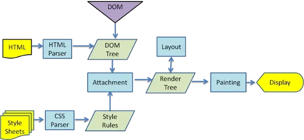

<!--
 * Author  rhys.zhao
 * Date  2023-05-26 13:46:34
 * LastEditors  rhys.zhao
 * LastEditTime  2023-07-07 15:32:25
 * Description
-->

# 浏览器原理

## 浏览器的主要功能

浏览器的主要功能就是**发出请求，并在浏览器窗口展示你选择的网络资源**。这里的网络资源一般是指 HTML 文档，也可以是 PDF、图片或者其他类型。

## 进程与线程

进程：运行的程序实例。**CPU 资源分配的最小单位。系统会分配独立的一块内存。**

线程：**CPU 调度的最小单位**。不会分配独立的内存。

可以这样理解：

进程好比是工厂。不同工厂之间是独立的。也就是说**各个进程间是独立的**。

线程好比是工人。**一个进程可以有一个或多个线程。同一进程下的多个线程共享内存**。

## 浏览器是多进程的

### 多进程的优势

浏览器是多进程的。这是出于以下两个方面的考虑：

1. **性能**

   多进程能够充分发挥多核 CPU 的优势。

2. **安全性、稳定性**

   **每个 Tab 页、插件都会开启一个独立的进程**。这样做可以：

   - 避免单个 Tab 页的崩溃影响整个浏览器。
   - 避免恶意代码或崩溃影响整个浏览器。

### 浏览器的主要进程

**1. Browser 进程**

浏览器进程。负责浏览器的主题部分展示及交互，以及协调其他进程之间的通信。

**2. Network 进程**

网络进程。负责页面的网络资源加载, 包括 HTML/CSS/JS 等。

**3. GPU 进程**

图像渲染进程。负责图形渲染、硬件加速、视频解码等工作。

GPU 的使用初衷是为了实现 CSS 3D 的效果。 后来网页、Chrome 的 UI 界面都选择采用 GPU 来绘制，这使得 GPU 成为浏览器普遍的需求。最后， Chrome 在其多进程架构上也引入了 GPU 进程。

**4. Plugins 进程**

每种类型的插件对应一个进程，使用该插件时创建。

**5. Renderer 进程**

浏览器渲染进程。每个 Tab 页都会在独立的渲染进程中运行，互不影响。主要工作有页面渲染，脚本执行，事件处理等。

除了这 5 个主要进程，在资源充足的情况下可能还会有 storage 进程、UI 进程、存储进程、设备进程、Audio 进程、Video 进程、Profile 进程等其他进程。

但对于前端开发来说，我们比较关心的是 Renderer(渲染)进程。

## Renderer 进程

### 常驻线程

浏览器渲染进程是**多线程**的。一些常驻线程有：

**1. 主线程**

也称为渲染线程或 UI 线程。负责渲染浏览器界面。包括解析 HTML, CSS, 构建 DOM 树和 RenderObject 树，布局和绘制等。当页面需要重绘和回流时，该线程就会执行。

**2. JS 引擎线程**

负责运行 JS 脚本。一个 Tab 页中只有一个 JS 引擎线程。

**GUI 线程与 JS 线程互斥**。也就是说 JavaScript 执行与页面渲染不能同时执行。

之所以设计成二者互斥是因为 JS 可以操作 DOM，如果在修改元素的同时渲染页面，渲染线程前后获取的元素可能不一致。

**3. 事件触发线程**

当 JS 引擎执行代码块如 setTimeOut 时（也可来自浏览器内核的其他线程, 如鼠标点击、AJAX 异步请求等），会将对应任务添加到事件线程中。

当对应的事件符合触发条件被触发时，该线程会把事件添加到待处理队列的队尾，等待 JS 引擎的处理

**4. 定时器线程**

setInterval 与 setTimeout 所在线程。

浏览器定时计数器并不是由 JavaScript 引擎计数的。这是由于 JavaScript 引擎是单线程的, 如果处于阻塞线程状态就会影响记计时的准确性。

因此通过单独线程来计时并触发定时。计时完毕后，添加到事件队列中，等待 JS 引擎空闲后执行。

**5. 异步 HTTP 请求线程**

在 XMLHttpRequest 在连接后是通过浏览器新开一个线程请求

当检测到状态变更时，如果设置有回调函数，异步线程就产生状态变更事件，将这个回调再放入事件队列中。再由 JavaScript 引擎执行。

**6. 合成线程（Compositor Thread）**

这个线程负责将渲染好的页面内容合成为最终的图像。它会将不同的图层进行合成，实现动画效果和页面滚动。

### Web Worker

对于密集型计算可以使用 Web Worker。

创建 Worker 时，Renderer 进程会单独开一个线程，也就是 worker 线程。

JS 引擎线程与 worker 线程间通过 `postMessage API` 通信。

所以，如果有非常耗时的工作，请单独开一个 Worker 线程，这样里面不管如何翻天覆地都不会影响 JS 引擎主线程，
只待计算出结果后，将结果通信给主线程即可。

而且注意下，JS 引擎是单线程的，这一点的本质仍然未改变，Worker 可以理解是浏览器给 JS 引擎开的外挂，专门用来解决那些大量计算问题。

### WebWorker 与 SharedWorker

WebWorker 只属于某个 Tab 页面，不会和其他页面的 Render 进程共享。

SharedWorker 是浏览器所有 Tab 页面共享的(共享型 Worker)，可以为多个 Render 进程共享使用。

SharedWorker 由独立的进程管理，WebWorker 只是属于 Render 进程下的一个线程。

## 从输入 URL 到页面渲染出来经历了什么？

### 从进程角度来分析

1. 用户输入 url 地址(如果是关键字，则根据默认引擎生成一个 url),会开始导航。这部分工作在 Browser 进程中做。
2. 浏览器进程准备一个渲染进程用于渲染页面。
3. 网络进程加载资源，最终将加载的资源交由渲染进程处理。
4. 渲染完毕再显示。

### 从细分的角度来讲

#### 1. 渲染前的工作

1. 当我们输入一个 URL 的时候，浏览器会先去查找缓存。如果有缓存，则直接返回缓存内容。
2. 如果没有缓存或者缓存已经过期，则进行域名解析(域名 => IP)。
3. 如果是 HTTPS, 则进行 SSL 协商
4. IP 地址进行寻址，排队等待。同一域名下最多能发送 6 个 http 请求
5. TCP 创建连接，三次握手
6. 利用 tcp 传输数据。拆分成数据包，有序传输，可靠传输(丢包重传)。服务器收到后，按照序号重排数据包。
7. http 请求 默认不会断开。keep-alive。为了保证下次传输数据时，可以复用上次创建的连接。
8. http 响应 响应码 301 302 会重定向 304 会查询浏览器缓存返回

#### 2. 渲染相关工作

1. 浏览器无法直接使用 HTML，需要将 HTML 转化成 DOM 树。（document）

2. 浏览器无法解析纯文本的 CSS 样式，需要对 CSS 进行解析,解析成 styleSheets。CSSOM（document.styleSeets）

3. 计算出 DOM 树中每个节点的具体样式（Attachment）

4. 创建渲染（布局）树，将 DOM 树中可见节点，添加到布局树中。并计算节点渲染到页面的坐标位置。（layout）

5. 通过布局树，进行分层 （根据定位属性、透明属性、transform 属性、clip 属性等）生产图层树

6. 将不同图层进行绘制，转交给合成线程处理。最终生产页面，并显示到浏览器上 (Painting,Display)

### 一个由来已久的问题

**为什么在 HTML 中， CSS 要放在顶端，JS 要放在下面?**

将 CSS 放在顶端，而将 JavaScript 放在底部是为了最佳的页面加载性能和用户体验。这种做法有以下原因：

- 页面渲染阻塞：当浏览器解析 HTML 文档时，会逐行解析并构建 DOM 树，遇到 CSS 样式表会进行下载和解析，如果 CSS 放在顶端，浏览器能够尽早获取并解析 CSS 样式，从而更快地开始渲染页面内容，避免出现未样式化的页面闪烁。

- 避免 JavaScript 阻塞：当浏览器遇到 JavaScript 脚本时，它会立即执行脚本，这可能导致阻塞页面的渲染和交互响应。将 JavaScript 放在页面底部可以确保在加载和渲染完页面内容后再执行 JavaScript，提高页面的响应速度和用户体验。

- 并行下载：现代浏览器通常会使用并行下载来提高资源获取速度。将 CSS 放在顶端可以让浏览器尽早获取并开始下载 CSS 文件，与此同时，浏览器可以并行下载其他资源，如 JavaScript、图片等，从而加快整个页面的加载速度。

需要注意的是，随着浏览器和网络的不断发展，这种传统的做法并不是绝对的规则。在某些情况下，例如在进行异步加载、延迟执行脚本或使用现代的构建工具时，将 JavaScript 放在顶部也可以实现更好的性能。因此，根据具体的情况和优化需求，适当调整 CSS 和 JavaScript 的位置是值得考虑的。

css 不会阻塞 html 解析。构架 dom 树不等待。渲染 dom 时候，需要等待样式加载完毕。如果把 css 文件放到下面，会渲染 dom，绘制。
然后加载 css，再次绘制。

js 会。因此使用 defer 跟 async。与 js 脚本会直接加载 js 脚本并执行。等待 js 执行完毕再继续解析 html.

js 阻塞 html 解析，也阻塞渲染。但 js 需要等到 css 加载完毕，保证页面 js 可以操作样式。

css 阻塞渲染，不阻塞解析。

## 最后

由于 Chrome 浏览器一直在更新，部分内容可能涉及时效性的问题。不过，对于前端开发来说，通过本文来了解浏览器的主要工作原理，还是 OK 的。

## 参考文档

[浏览器原理——看完这篇可以尝试和面试官扯皮了](https://juejin.cn/post/7171419987603619848)

[从浏览器多进程到 JS 单线程，JS 运行机制最全面的一次梳理](https://juejin.cn/post/6844903553795014663)

[浏览器渲染原理与性能优化](https://www.bilibili.com/video/BV1yy4y1i7o1/?p=1&vd_source=41e6d1d28e504860272fd13300cb250c)
