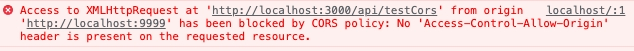

<!--
 * Author  rhys.zhao
 * Date  2023-07-06 16:01:54
 * LastEditors  rhys.zhao
 * LastEditTime  2023-07-13 10:03:29
 * Description
-->

# 跨域

## 为什么会跨域

一般情况下，当浏览器向不同 源(协议、IP、端口)的资源发出请求时，会报错误如下：



这就是 跨域 问题。

跨域是因为浏览器的**同源策略**所导致的。

### 什么是同源策略

浏览器出于[安全](https://juejin.cn/post/7147638444355747870)的考虑做了同源策略的限制。**源指的是协议、IP、端口。** 协议、IP、端口 必须全都相同才是同源。

## 解决方案

### 1. JSONP

**只支持 Get 请求，并且只能接收 json 格式的数据，还容易收到 XSS 攻击。不推荐。**

```js
<script>
    function handleResponse(res) {
      console.log(res);
    }

    var script = document.createElement('script');
    script.src = 'https://10.2.2.25/api?callback=handleResponse';
    document.head.appendChild(script);
</script>
```

其实就是动态创建一个 script 标签，并在标签里加入 callback 参数, 然后在回调函数里处理后端返回的数据。

### 2. CORS

**官方推荐，后端处理，推荐。**

CORS（Cross-Origin Resource Sharing）是一种官方推荐的跨域解决方案。它通过在服务器端设置响应头来允许跨域访问。具体而言，服务器在响应中添加 Access-Control-Allow-Origin 头，并设置允许访问的源地址。浏览器在收到这个响应头后，就会允许跨域访问并将响应数据返回给前端页面。CORS 支持各种类型的 HTTP 请求，包括 GET、POST 等，并且具有较好的安全性。

### 3. proxy

既然跨域是浏览器导致的，那我们绕开浏览器就行了。使用代理也是常用的解决跨域的方案。

请求的资源跨域，我们可以请求自己同源的服务(代理)，然后**通过代理去请求跨域的资源**。常用的解决方案一般是两种：

#### 本地代理

**开发环境，前端处理，推荐。**

无论是 webpack 还是 vite 都内置了本地代理。这让我们能够在不依赖后端的前提下解决跨域的问题(仅仅是本地开发环境下, 线上环境需要 nginx 配置反向代理)

webpack 的处理方式如下(官方文档看[这里](https://webpack.docschina.org/configuration/dev-server/#devserverproxy)):

```js
module.exports = {
  //...
  devServer: {
    proxy: {
      '/api': 'http://localhost:3000'
    }
  }
};
```

vite 的处理方式(官方文档看[这里](https://cn.vitejs.dev/config/server-options.html#server-proxy)):

```js
export default defineConfig({
  // ...
  server: {
    proxy: {
      '/api': {
        target: 'http://jsonplaceholder.typicode.com',
        changeOrigin: true,
        rewrite: (path) => path.replace(/^\/api/, '')
      }
    }
  }
});
```

#### nginx 反向代理

**生产环境，运维处理，推荐。**

生产环境一般用 nginx 托管部署我们的前端代码包。处理跨域问题需要 nginx 配置反向代理。

```conf
server {
    listen: 8001;
    server_name 10.2.2.25;

    location ~ /api/ {
        proxy_pass http://127.0.0.1:8081;
    }
}
```

## 参考文档

[Web 安全开篇：浏览器为什么会有同源策略？](https://juejin.cn/post/7147638444355747870)
