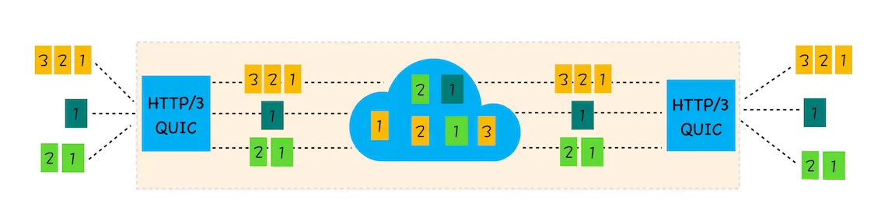

<!--
 * Author  rhys.zhao
 * Date  2023-07-06 15:47:11
 * LastEditors  rhys.zhao
 * LastEditTime  2023-07-07 14:18:41
 * Description
-->

# HTTP

# http 简史

## http 0.9

只有 GET 请求

### http 1.0

引入了请求头和响应头。可以根据 Header 的不同来处理不同的资源。

引入了状态码。

引入了服务端缓存机制，减轻服务器压力。

### http 1.1

默认开启 keep-alive, 持久连接。

管道化。连接复用。同一个域名，默认允许同时建立 6 个 TCP 持久连接。避免了每次请求都要 TCP 三次握手、四次挥手的过程。

引入了 Cookie。

### http 2

头部压缩，减少请求数据的大小。

多路复用。一个域名建立一个 TCP 连接。

服务器可以推送数据给客户端。

### http 3

采用 UDP。解决了 TCP 的队头阻塞问题。在 UDP 上加了一个 QUIC（快速 UDP 互联网连接）协议。

HTTP/3 中的 QUIC 协议集合了以下几点功能:

1. 实现了类似 TCP 的流量控制、传输可靠性的功能。

虽然 UDP 不提供可靠性的传输，但 QUIC 在 UDP 的基础之上增加了一层来保证数据可靠性传输。它提供了数据包重传、拥塞控制以及其他一些 TCP 中存在的特性。

2. 集成了 TLS 加密功能。

目前 QUIC 使用的是 TLS1.3，相较于早期版本 TLS1.3 有更多的优点，其中最重要的一点是减少了握手所花费的 RTT 个数。

3. 实现了 HTTP/2 中的多路复用功能。

和 TCP 不同，QUIC 实现了在同一物理连接上可以有多个独立的逻辑数据流（如下图）。实现了数据流的单独传输，就解决了 TCP 中队头阻塞的问题。

4. 实现了快速握手功能。

由于 QUIC 是基于 UDP 的，所以 QUIC 可以实现使用 0-RTT 或者 1-RTT 来建立连接，这意味着 QUIC 可以用最快的速度来发送和接收数据，这样可以大大提升首次打开页面的速度。

## HTTPS

## HTTP 缓存

### 强缓存

## 协商缓存
