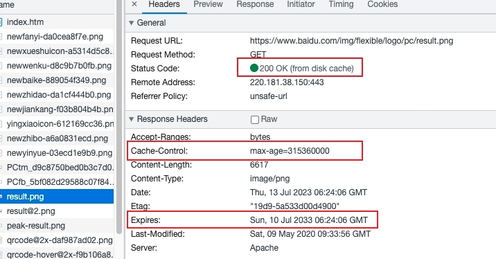
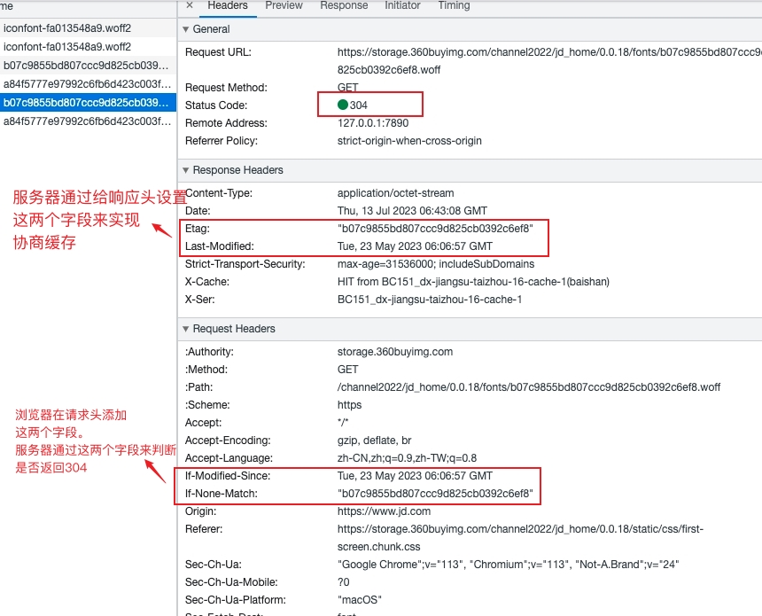

<!--
 * Author  rhys.zhao
 * Date  2023-07-06 15:47:11
 * LastEditors  rhys.zhao
 * LastEditTime  2023-07-13 16:28:04
 * Description
-->

# http

## http 0.9

只有 GET 请求, 响应只有文件内容本身

## http 1.0

**特点：**

1. 引入了请求头和响应头。可以根据 Header 的不同来处理不同的资源。

2. 引入了状态码。

3. 引入了服务端缓存机制，减轻服务器压力。

4. 支持长链接，默认是短连接。

**缺点：**

1. 队头阻塞：等上一个请求响应后，才可以下一次请求。上一个请求迟迟没有响应，就会阻塞下一次请求。

2. 默认是短连接，每个 TCP 连接只能发送一个 http 请求。也就是说每个 http 请求都要使用 TCP 的三次握手与四次挥手。

## http 1.1

**特点：**

1. 默认开启 keep-alive, 长连接。

2. http 请求可以复用 TCP 连接。

3. 管线化。同一个域名，默认允许同时建立 6 个 TCP 长连接。也就是说同一时间最多可以有 6 个 http 请求。

4. 引入了 Cookie。

**缺点：**

1. 队头阻塞：6 个 TCP 长连接能够，但是依然存在队头阻塞的问题。

2. http 头部内容较多，增加了传输成本

3. 明文传输，不安全

## http 2

**特点：**

1. 头部压缩，减少请求数据的大小。

2. 多路复用，并行请求。一个域名建立一个 TCP 连接。单个 TCP 连接可以承载任意数量的 http 请求。

3. 服务器可以推送数据给客户端。

4. 使用 TLS 来加密通信，更安全。

**缺点：**

1. 增加了连接延时。TLS 握手也需要一定时间。

2. 依然存在队头阻塞。由于只有一个 TCP 连接，一旦丢包，整个 TCP 都要等待重传，这会阻塞该 TCP 连接中的所有请求。

3. 多路复用导致服务器压力增大

4. 多路复用导致带宽、服务器等资源稀释，容易造成超时

## http 3

**采用 UDP**。解决了 TCP 的队头阻塞问题。在 UDP 上加了一个 QUIC（快速 UDP 互联网连接）协议。

http3 中的 QUIC 协议集合了以下几点功能:

1. 实现了类似 TCP 的流量控制、传输可靠性的功能。

虽然 UDP 不提供可靠性的传输，但 QUIC 在 UDP 的基础之上增加了一层来保证数据可靠性传输。它提供了数据包重传、拥塞控制以及其他一些 TCP 中存在的特性。

2. 集成了 TLS 加密功能。

目前 QUIC 使用的是 TLS1.3，相较于早期版本 TLS1.3 有更多的优点，其中最重要的一点是减少了握手所花费的 RTT 个数。

3. 实现了多路复用的功能。

和 TCP 不同，QUIC 实现了在同一物理连接上可以有多个独立的逻辑数据流。实现了数据流的单独传输，就解决了 TCP 中队头阻塞的问题。

4. 实现了快速握手功能。

由于 QUIC 是基于 UDP 的，所以 QUIC 可以实现使用 0-RTT 或者 1-RTT 来建立连接，这意味着 QUIC 可以用最快的速度来发送和接收数据，这样可以大大提升首次打开页面的速度。

## https

### http 与 https 区别

二者的主要区别在于安全性。

1. http 是明文传输，https 使用 SSL/TLS 协议进行加密。

2. https 要求使用数字证书。一定程度上避免了中间人攻击。

3. http 端口是 80，https 端口是 443

### https 工作流程

### https 是如何保证安全的

#### 1. 加密

#### 2. 证书

## http 缓存

### 强缓存

强缓存是指浏览器在第一次请求资源时，将资源缓存到本地。并在下一次请求时直接从缓存中获取，而不是向服务器发送请求。

强缓存会返回状态码 **200 OK（from memory cache）** 或者 **200 OK（from disk cache）**

强缓存可以通过设置 http 响应头中的 **Cache-Control** 和 **Expires** 字段来实现。

- **Cache-Control**: 用来设置缓存的最大时间。

- **Expires**: 用来设置缓存的过期时间。

当二者同时设置时候，**Cache-Control** 优先级更高。

### 协商缓存

协商缓存是浏览器在第一次请求资源时，服务器会返回一个包含资源信息的响应头 **(ETag 和 Last-Modified)**，浏览器会将信息保存在缓存中。下一次请求时，浏览器会将这些信息 **(If-Modified-Since 和 If-None-Match)** 发送给服务器，服务器会根据这些信息判断资源是否更新。如果没有更新，则返回一个 304 的响应，告诉浏览器可以直接从缓存中获取资源。

也就是说，浏览器会根据服务器返回的信息来决定是否使用缓存。

协商缓存可以通过设置 http 响应头中的 **ETag** 和 **Last-Modified** 字段来实现。

- **ETag**: URL 的 tag，用来标识 URL 对应的资源是否改变。

- **Last-Modified**: 用来设置资源最后修改时间。

下次请求时, 会在请求头加上 **If-Modified-Since** 和 **If-None-Match** 来确认是否使用缓存（其实就是跟设置的 **ETag** 和 **Last-Modified** 作比较）。

## 参考文档

[解读 HTTP1/HTTP2/HTTP3](https://juejin.cn/post/6995109407545622542)

[Web 开发中的强缓存和协商缓存策略](https://juejin.cn/post/7239630585500876857)
