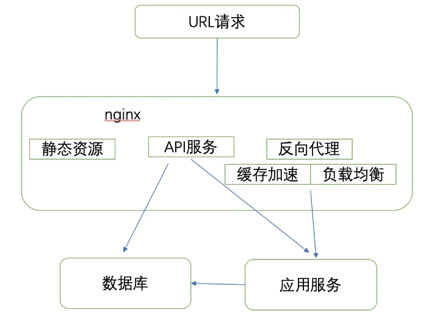
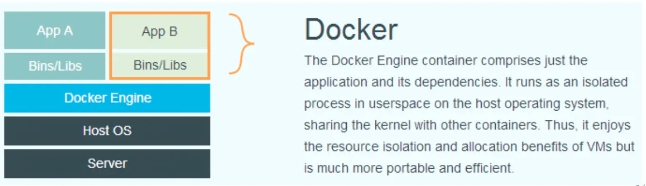

<!--
 * Author  rhys.zhao
 * Date  2023-07-25 19:24:11
 * LastEditors  rhys.zhao
 * LastEditTime  2023-07-27 16:26:12
 * Description
-->

# 前端技能/工具整理

## 基本

HTML
CSS
JavaScript
ES6

## 扩展语言

Sass
Less
TypeScript

## JavaScript 框架

React
Vue

## 构建、打包工具

webpack
vite
rollup

## 工程代码规范

husky
lint-staged
eslint
prettier
stylelint
commitlint

## 服务端相关

- Node.js

服务端的 JavaScript 运行环境，基于 V8 引擎。我们运行 JavaScript，要么在浏览器，要么在 Node.

- Express

基于 Node.js 的 Web 服务端开发框架。

- Nest.js

服务端开发框架。基于 Express，但比 Express 更为强大。

- mangoDB

文档型数据库，在数据库中数据是通过 key-value 的形式存储的。

## CI/CD 相关

- Nginx

高性能 Web 静态资源服务器。一般情况下，前端打包后的静态文件都是通过 Nginx 开启 Web 服务的。

- Docker

1. 什么是 Docker

Docker 是一种开源的容器化平台，它允许开发者将应用程序及其所有依赖项打包成一个独立的、标准化的容器。这个容器可以在任何支持 Docker 的环境中运行，无论是开发者的本地计算机、测试服务器，还是生产服务器，都可以保持一致的运行环境。

可以简单理解为 Docker 是轻量的虚拟机，虚拟机里面是应用程序/服务。

2. 为什么不直接用 Nginx 部署

直接用 Nginx 部署称为**裸机部署**。但是使用 Docker 来部署应用程序有更多优势：

a. **环境一致性：** Docker 可以将应用程序及其所有依赖项打包成一个独立的容器，这保证了在不同环境中运行应用程序时，可以保持一致的运行环境。

b. **快速部署：** 使用 Docker 可以快速创建、启动和停止容器，部署变得非常简单和高效。只需运行一个 Docker 容器，就能轻松地将应用程序部署到任何支持 Docker 的环境中。

c. **可移植性：** Docker 容器是轻量级、可移植的，可以在不同平台和环境中运行，确保应用程序在开发、测试和生产环境中具有一致的行为。

d. **隔离性和安全性：** Docker 利用 Linux 的容器技术，将应用程序和依赖项隔离在容器中，确保它们不会干扰宿主系统或其他容器。这提供了一定的安全性，即使容器内的应用程序出现问题，也不会影响其他容器和宿主系统。

e. **版本控制和回滚：** 使用 Docker，你可以非常方便地管理不同版本的应用程序和服务，并可以轻松地回滚到之前的版本，以应对故障或问题。

f. **扩展性：** Docker 可以根据应用程序的需求，方便地扩展容器数量，以满足不断增长的流量和负载。

- K8s

Kubernetes（通常简称为 K8s）是一个开源的容器编排平台，用于自动化部署、扩展和管理容器化应用程序。

a. **容器编排：** Kubernetes 允许开发者定义应用程序的运行配置和服务依赖，并确保在集群中按照指定的规则自动部署和扩展容器。

b. **自动化部署和伸缩：** Kubernetes 可以根据应用程序的需求自动在集群中创建、更新和删除容器。它可以根据负载和资源需求自动伸缩应用程序，从而提供高可用性和性能。

c. **服务发现和负载均衡：** Kubernetes 提供内建的服务发现和负载均衡功能，使得应用程序可以轻松地互相访问，并能够平衡请求的负载。

d. **自我修复：** Kubernetes 具有自我修复机制，可以监控应用程序的健康状态，并在出现故障时自动恢复。

e. **滚动更新：** Kubernetes 支持无缝滚动更新应用程序，以确保应用程序的持续提供服务而无需中断。

f. **存储编排：** Kubernetes 允许开发者声明应用程序对存储资源的需求，并自动将存储资源与应用程序关联起来。

g. **配置管理：** Kubernetes 可以管理应用程序的配置信息，并在需要时自动更新配置。

i. **多集群管理：** Kubernetes 支持多集群管理，可以同时管理多个 Kubernetes 集群，从而构建复杂的多地区或多云环境。

- zx.js

一个可以使用 Node.js 编写 Shell 脚本的工具

## SSR

优点：

更好的 SEO

更快的首屏渲染(不能交互)。

缺点：

更慢的可交互时间。

- Next.js

基于 React 全栈框架。常用来做 SSR 应用。

- Remix.js

基于 React 全栈框架。常用来做 SSR 应用。与 Next.js 各有优劣。

- Nuxt.js

基于 Vue 的通用应用框架。可以 CSR, 也可以 SSR。

## 单元测试

- Jest

JavaScript 测试框架。可以配合 Enzyme 来测试组件。

- Vitest

由 Vite 提供支持的单元测试框架

## 微前端

微前端是一种前端架构模式，旨在将复杂的前端应用程序拆分为更小的、独立的部分，每个部分被称为一个微前端。每个微前端都是一个独立的、可独立开发和部署的前端应用，它们可以通过组合或集成的方式组成一个完整的前端应用。微前端的核心目标是提高前端应用的可维护性、可扩展性和团队协作效率。

微前端的优点包括：

1. 模块化开发：微前端将前端应用拆分成更小的模块，每个模块可以由不同的团队独立开发和维护。这样可以简化代码库，提高模块的复用性和可维护性。

2. 独立部署：每个微前端都可以单独进行部署，不会影响其他微前端的运行。这使得前端应用的部署变得更加灵活和高效。

3. 技术栈多样性：不同的微前端可以使用不同的技术栈和框架，无需担心冲突。这使得团队可以根据自己的需求和技能选择合适的技术栈。

4. 独立团队开发：每个微前端都可以由独立的团队开发，提高了团队之间的协作效率，减少了团队之间的耦合。

5. 性能优化：微前端可以根据需求进行按需加载，减少前端应用的初始化加载时间。

目前，有一些流行的微前端框架和工具，可以帮助开发者实现微前端架构。其中一些框架和工具包括：

1. single-spa：一个开源的 JavaScript 微前端框架，可以将多个独立的前端应用组合成一个整体应用。

2. qiankun：一个基于 single-spa 的微前端解决方案，由蚂蚁金服开源。

3. Micro App：京东出品，基于 Web Component 的微前端框架。

4. 无界：腾讯出品，基于 WebComponent 容器 + iframe 沙箱的微前端框架

这些微前端框架和工具提供了一种简单、灵活的方式来实现微前端架构，并支持不同技术栈和团队之间的独立开发和部署。选择合适的微前端框架取决于具体的项目需求和团队技术栈。

## 其他端

- Electron

使用 JavaScript、HTML 和 CSS 构建桌面应用程序的框架。

- Flutter

高性能、跨端 UI 框架，可以通过一套代码，支持 iOS、Android、Windows/MAC/Linux 等多个平台，接近原生性能。

使用 `Dart` 语言劝退了多数前端开发者。

- Taro

京东出品的跨端跨框架解决方案。主要用来做小程序、H5、RN 等应用。

## 搭建私有库

- verdaccio

用来搭建私库。

提供了一个基本的组件页面，但是写接口文档过于麻烦，可以使用 dumi

- father

组件/库 构建打包工具

- dumi

组件/库 项目脚手架。生成的项目模板包括组件以及组件文档(可在线预览，加入了 sandbox)。

使用 father 构建、打包。

可打包 npm 包和组件/库文档网站包。
